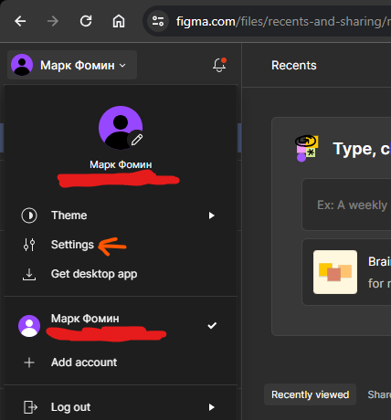
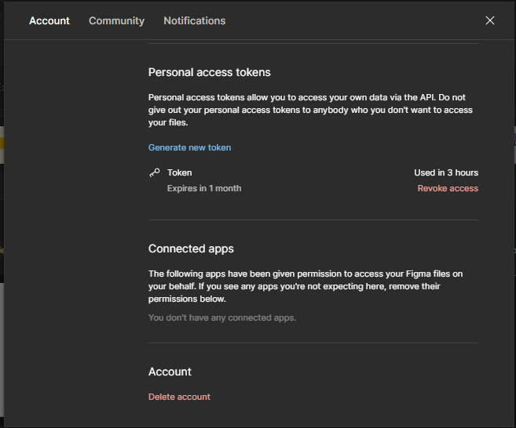
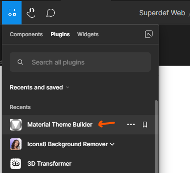
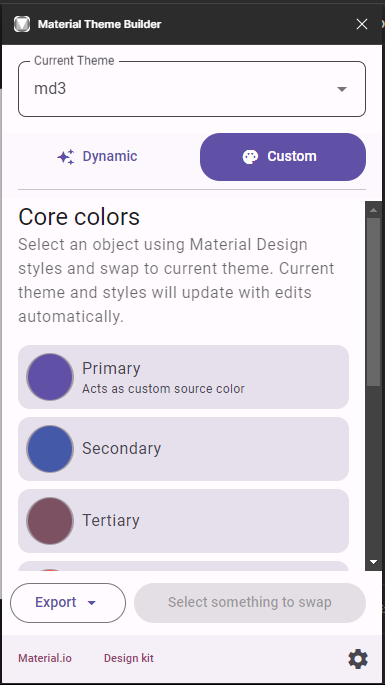
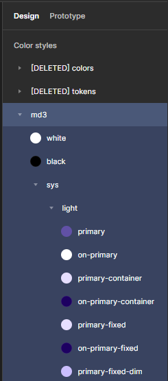
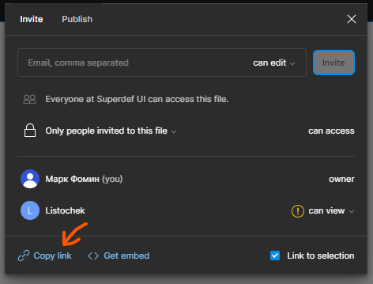

# Material Theme Figma to CSS Converter

This script converts the color styles created by the Material Theme Builder plugin in Figma into a CSS file.

This option is better than https://m3.material.io/theme-builder -> Export as Web (CSS), because the official export function still doesn't support the new tone-based surfaces introduced by the Material Design team on **March 23, 2023**. This script, unlike the official export function, supports the new surface colors (`surface-container-low`, etc) and the new colors introduced (`primary-fixed`, `primary-fixed-dim`, etc). More details here: https://material.io/blog/tone-based-surface-color-m3.

# Run
To run this script, you need to following things:
* ## Access token
    Go to https://figma.com, user profile -> Settings -> Account -> Personal access tokens -> Generate new token
    
    
* ## Figma URL
    * Open your Figma file
    * Search for the plugin "Material Theme Builder"

        
    * Select 3 key colors and build a theme
    
        
    * Check that your theme was converted to color styles

        
    * Share -> Copy link

        

```bash
$ git clone https://github.com/difhel/material-theme-figma-to-css
$ cd material-theme-figma-to-css
$ pip install requests
$ python3 main.py
> [1] Your Figma access token: figd_***_**
> [2] Your Figma URL: https://www.figma.com/file/************************/******?type=design&node-id=0%3A1&mode=design
Step 1. Getting local styles list
Step 2. Getting values
Step 3. Exporting colors to CSS file...
Done. The colors have been written to /home/mf/material-theme-figma-to-css/output.css
```